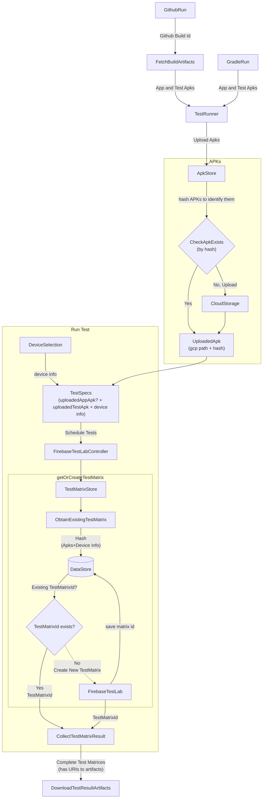

Below is a FlowChart of each step when running tests.

```mermaid
graph TB
    DataStore[(DataStore)]
    CloudStorage[CloudStorage]
    CheckApkExists{"CheckApkExists</br>(by hash)"}
    ApkStore[ApkStore]
    HasTestMatrix{TestMatrixId exists?}
    UploadedApk["UploadedApk<br/>(gcp path + hash)"]
    TestSpecs["TestSpecs<br/>(uploadedAppApk? + uploadedTestApk + device info)"]
    GithubRun--->|Github Build Id|FetchBuildArtifacts
    FetchBuildArtifacts--->|App and Test Apks|TestRunner
    GradleRun--->|App and Test Apks|TestRunner
    TestRunner--->|Upload Apks|ApkStore
    subgraph "__APKs"
      ApkStore--->|hash APKs to identify them|CheckApkExists
      CheckApkExists-->|Yes|UploadedApk
      CheckApkExists-->|No, Upload|CloudStorage
      CloudStorage-->UploadedApk
    end
    subgraph "Run Test"
    DeviceSelection-->|device info|TestSpecs
    UploadedApk-->TestSpecs
    TestSpecs-->|Schedule Tests|FirebaseTestLabController
    FirebaseTestLabController-->TestMatrixStore
    subgraph "getOrCreateTestMatrix"
    TestMatrixStore-->ObtainExistingTestMatrix
    ObtainExistingTestMatrix-->|"Hash<br/>(Apks+Device Info)"|DataStore
    DataStore-->|Existing TestMatrixId?|HasTestMatrix
    HasTestMatrix-.->|"No </br>Create New TestMatrix"|FirebaseTestLab
    FirebaseTestLab-->|save matrix id|DataStore
    end
    HasTestMatrix--->|"Yes</br>TestMatrixId"|CollectTestMatrixResult
    
    end
    FirebaseTestLab-->|TestMatrixId|CollectTestMatrixResult
    CollectTestMatrixResult-->|"Complete Test Matrices</br>(has URIs to artifacts)"|DownloadTestResultArtifacts
```
